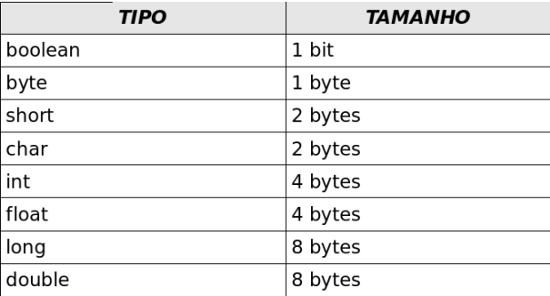
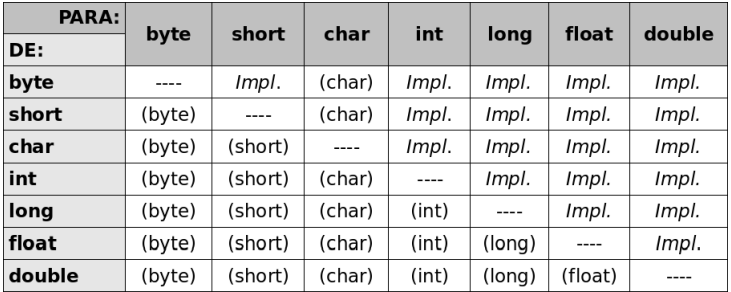

# JAVA - INTRODUÇÃO

## ***Como o Java funciona*?**

**"Write Once, Run EveryWhere"**

Basicamente, as aplicações **.java** não rodam diretamente no SO. Elas passam por um processo de **compilação** através
do comando **javac**. Após a compilação, é gerado um arquivo .class (bytecode) que será executado na JVM (Java Virtual
Machine). A JVM atua como intermediária entre o SO e a aplicação Java, permitindo que o mesmo programa rode em todos os
Sistemas Operacionais. Mas cada Sistema Operacional tem sua JVM própria.

Como obter a JVM no seu computador?

É muito simples: basta instalar a JDK (Java Development Kit), que inclui todas as ferramentas de desenvolvimento como
compilador, debugger, jar e outras. Além disso, você precisa da JRE (Java Runtime Environment), que contém a JVM e as
bibliotecas básicas.

Uma característica notável do Java é sua retrocompatibilidade: programas desenvolvidos em versões antigas do Java podem
ser executados em versões mais recentes.

# Organizando o código em pacotes

O Java é uma linguagem orientada a pacotes também, precisamos manter tudo organizado para uma melhor compreensão. Temos
uma convenção para criação de pacotes:

URL do site invertida + nome do projeto + divisões

Exemplo: com.mauricioxavier.maratonajava.introducao

cada . é uma pasta.

# Tipos Primitivos e Tamanhos

Na tabela abaixo, estão os tamanhos de cada tipo primitivo do Java:

#### Casting: Quando queremos declarar uma variável que aquele tipo não suporta, exemplo:

int numero = 1052,20 - tecnicamente não posso colocar um número decimal em tipo inteiro, então eu faço um casting: int
numero = (int) 1052,20